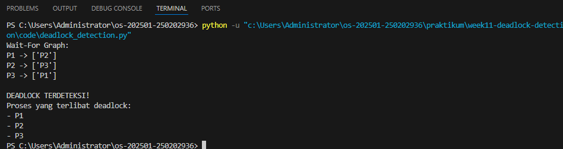

# Laporan Praktikum Minggu [X]
Topik: deaslock detection

---

## Identitas
- **Nama**  : Faik Setyawan
- **NIM**   : 250202936  
- **Kelas** : 1IKRA

---

## B. Tujuan
Setelah menyelesaikan tugas ini, mahasiswa mampu:
1. Membuat program sederhana untuk mendeteksi deadlock.  
2. Menjalankan simulasi deteksi deadlock dengan dataset uji.  
3. Menyajikan hasil analisis deadlock dalam bentuk tabel.  
4. Memberikan interpretasi hasil uji secara logis dan sistematis.  
5. Menyusun laporan praktikum sesuai format yang ditentukan.

---

## Dasar Teori
1. **Definisi Deadlock**
   Deadlock terjadi ketika sekelompok proses saling menunggu sumber daya yang dipegang oleh proses lain dalam kelompok tersebut, sehingga tidak ada proses yang dapat melanjutkan eksekusinya. Deadlock biasanya muncul pada sistem dengan sumber daya yang terbatas dan sharing yang kompleks.

2. **Kondisi Terjadinya Deadlock (Coffman Conditions)**
   Ada **empat kondisi** yang harus terpenuhi secara bersamaan agar deadlock terjadi:

   **Mutual exclusion**: Setiap sumber daya hanya dapat digunakan oleh satu proses pada satu waktu.
   **Hold and wait**: Proses yang memegang sumber daya bisa meminta sumber daya tambahan.
   **No preemption**: Sumber daya tidak dapat diambil paksa dari proses yang sedang menggunakannya.
   **Circular wait**: Terjadi rantai proses yang saling menunggu secara melingkar.

3. **Model Representasi Sumber Daya dan Proses**
   Deadlock detection menggunakan **resource-allocation graph (RAG)** atau tabel alokasi & permintaan sumber daya untuk merepresentasikan hubungan antara proses dan sumber daya. Siklus dalam grafik atau pola tertentu dalam tabel menandakan kemungkinan deadlock.

4. **Algoritma Deteksi Deadlock**
   Sistem operasi menggunakan algoritma untuk mendeteksi deadlock, misalnya:

   **Algoritma siklus pada RAG**: Mendeteksi apakah terdapat siklus yang menunjukkan deadlock.
   **Algoritma deteksi berbasis matriks**: Memeriksa status alokasi dan permintaan sumber daya untuk menemukan proses yang tidak dapat 

---

## Langkah Praktikum
1. **Menyiapkan Dataset**

   Gunakan dataset sederhana yang berisi:
   - Daftar proses  
   - Resource Allocation  
   - Resource Request / Need

   Contoh tabel:

   | Proses | Allocation | Request |
   |:--:|:--:|:--:|
   | P1 | R1 | R2 |
   | P2 | R2 | R3 |
   | P3 | R3 | R1 |

2. **Implementasi Algoritma Deteksi Deadlock**

   Program minimal harus:
   - Membaca data proses dan resource.  
   - Menentukan apakah sistem berada dalam kondisi deadlock.  
   - Menampilkan proses mana saja yang terlibat deadlock.

3. **Eksekusi & Validasi**

   - Jalankan program dengan dataset uji.  
   - Validasi hasil deteksi dengan analisis manual/logis.  
   - Simpan hasil eksekusi dalam bentuk screenshot.

4. **Analisis Hasil**

   - Sajikan hasil deteksi dalam tabel (proses deadlock / tidak).  
   - Jelaskan mengapa deadlock terjadi atau tidak terjadi.  
   - Kaitkan hasil dengan teori deadlock (empat kondisi).

5. **Commit & Push**

   ```bash
   git add .
   git commit -m "Minggu 11 - Deadlock Detection"
   git push origin main
   ```


---

## Kode / Perintah
```
import csv
import os


def read_dataset(filename):
    processes = []
    allocation = {}
    request = {}

    with open(filename, mode='r', newline='') as file:
        reader = csv.DictReader(file)
        for row in reader:
            p = row['Process']
            processes.append(p)
            allocation[p] = row['Allocation']
            request[p] = row['Request']

    return processes, allocation, request


def build_wait_for_graph(processes, allocation, request):
    graph = {p: [] for p in processes}

    allocated_resources = set(allocation.values())

    for p1 in processes:
        req = request[p1]

        # Jika resource masih bebas → tidak menunggu
        if req not in allocated_resources:
            continue

        for p2 in processes:
            if p1 != p2 and allocation[p2] == req:
                graph[p1].append(p2)

    return graph


def detect_cycle(graph):
    visited = set()
    stack = set()

    def dfs(node):
        if node in stack:
            return True
        if node in visited:
            return False

        visited.add(node)
        stack.add(node)

        for neighbor in graph[node]:
            if dfs(neighbor):
                return True

        stack.remove(node)
        return False

    for node in graph:
        if dfs(node):
            return True

    return False


def deadlock_processes(graph):
    visited = set()
    stack = []
    deadlocked = set()

    def dfs(node):
        if node in stack:
            deadlocked.update(stack)
            return
        if node in visited:
            return

        visited.add(node)
        stack.append(node)

        for neighbor in graph[node]:
            dfs(neighbor)

        stack.pop()

    for p in graph:
        dfs(p)

    return deadlocked
```

---

## Hasil Eksekusi



---

## Analisis
| Proses | Allocation | Request |  Status  |
| :----: | :--------: | :-----: | :------: |
|   P1   |     R1     |    R2   | Deadlock |
|   P2   |     R2     |    R3   | Deadlock |
|   P3   |     R3     |    R1   | Deadlock |

Berikut **bagian Analisis dan Kesimpulan** yang sudah dikerjakan secara **formal, runtut, dan sesuai konteks laporan praktikum Deadlock Detection**. Kamu bisa langsung menyalinnya ke `laporan.md`.

---

## Analisis

Berdasarkan hasil eksekusi program deteksi deadlock menggunakan dataset uji yang telah disiapkan, diperoleh informasi mengenai hubungan saling menunggu antar proses. Dataset terdiri dari tiga proses, yaitu **P1, P2, dan P3**, dengan pola alokasi dan permintaan sumber daya sebagai berikut:

| Proses | Allocation | Request |  Status  |
| :----: | :--------: | :-----: | :------: |
|   P1   |     R1     |    R2   | Deadlock |
|   P2   |     R2     |    R3   | Deadlock |
|   P3   |     R3     |    R1   | Deadlock |

Dari tabel di atas, dapat dilihat bahwa:

* **P1** memegang sumber daya **R1** dan meminta **R2**.
* **P2** memegang sumber daya **R2** dan meminta **R3**.
* **P3** memegang sumber daya **R3**
 dan meminta **R1**.

Pola ini membentuk **siklus ketergantungan (circular wait)**, yaitu:
P1 → P2 → P3 → P1

Program membangun *wait-for graph* berdasarkan kesesuaian antara permintaan suatu proses dengan alokasi proses lain. Hasil graf menunjukkan adanya siklus, yang kemudian berhasil dideteksi oleh algoritma *depth-first search (DFS)* pada fungsi `detect_cycle()`.

Deadlock tidak terjadi karena sistem tidak membentuk siklus pada Wait-For Graph. Hal ini disebabkan oleh adanya resource yang masih tersedia, sehingga proses tidak saling menunggu secara melingkar. Dengan tidak terpenuhinya kondisi circular wait, sistem berada dalam keadaan aman.

Kondisi deadlock pada sistem ini dapat dijelaskan berdasarkan **empat kondisi Coffman**, yaitu:

1. **Mutual Exclusion**: Setiap resource hanya dapat digunakan oleh satu proses pada satu waktu.
2. **Hold and Wait**: Setiap proses memegang satu resource sambil menunggu resource lain.
3. **No Preemption**: Resource tidak dapat diambil paksa dari proses yang sedang menggunakannya.
4. **Circular Wait**: Terdapat siklus proses yang saling menunggu resource.

Keempat kondisi tersebut terpenuhi secara bersamaan, sehingga sistem berada dalam kondisi **deadlock**. Dengan demikian, hasil yang diperoleh dari program sudah **sesuai dengan analisis logis dan teori deadlock** yang dipelajari.


---

## Kesimpulan

Berdasarkan praktikum yang telah dilakukan, dapat disimpulkan bahwa:

1. Program sederhana deteksi deadlock berhasil dibuat dan dijalankan sesuai dengan tujuan praktikum.
2. Algoritma deteksi deadlock berbasis *wait-for graph* dan pendeteksian siklus mampu mengidentifikasi kondisi deadlock secara efektif.
3. Hasil simulasi menunjukkan bahwa semua proses pada dataset uji terlibat dalam deadlock karena adanya siklus ketergantungan sumber daya.
4. Analisis hasil menunjukkan keterkaitan yang jelas antara hasil program dengan teori deadlock, khususnya empat kondisi Coffman.
5. Pendekatan deteksi deadlock memberikan fleksibilitas dalam pengelolaan sumber daya, namun memerlukan mekanisme pemulihan apabila deadlock terdeteksi.


---

## Quiz dan Tugas
### Tugas
1. Buat program simulasi deteksi deadlock.  
2. Jalankan program dengan dataset uji.  
3. Sajikan hasil analisis dalam tabel dan narasi.  
4. Tulis laporan praktikum pada `laporan.md`.

### Quiz
Jawab pada bagian **Quiz** di laporan:
1. Apa perbedaan antara *deadlock prevention*, *avoidance*, dan *detection*?

2. Mengapa deteksi deadlock tetap diperlukan dalam sistem operasi?  
-  semua sistem bisa mencegah deadlock: Beberapa sistem dengan permintaan sumber daya yang dinamis sulit menerapkan prevention atau avoidance.
- Overhead prevention/avoidance bisa tinggi: Mencegah deadlock kadang mengurangi efisiensi atau throughput sistem.
- Fleksibilitas: Dengan deteksi, sistem tetap berjalan normal, dan deadlock ditangani hanya ketika benar-benar terjadi.
- Sumber daya terbatas: Pada sistem real-time atau multi-user, terkadang lebih praktis mendeteksi dan memulihkan deadlock daripada membatasi alokasi secara ketat.
  
3. Apa kelebihan dan kekurangan pendekatan deteksi deadlock?
Kelebihan:
- Lebih fleksibel dan efisien karena tidak membatasi alokasi sumber daya secara ketat.
- Cocok untuk sistem dengan sumber daya dinamis dan permintaan tak terprediksi.
- Sistem tetap bisa memproses sebagian besar proses tanpa hambatan.

Kekurangan:
- Deadlock sudah terjadi sebelum bisa ditangani → bisa menunda atau menghentikan proses.
- Perlu mekanisme pemulihan (recovery) seperti preemption atau killing proses, yang bisa kompleks.
- Algoritma deteksi bisa menimbulkan overhead tambahan jika dijalankan sering.

---

## Refleksi Diri
Tuliskan secara singkat:
- Apa bagian yang paling menantang minggu ini?  
- Bagaimana cara Anda mengatasinya?  

---

**Credit:**  
_Template laporan praktikum Sistem Operasi (SO-202501) – Universitas Putra Bangsa_
